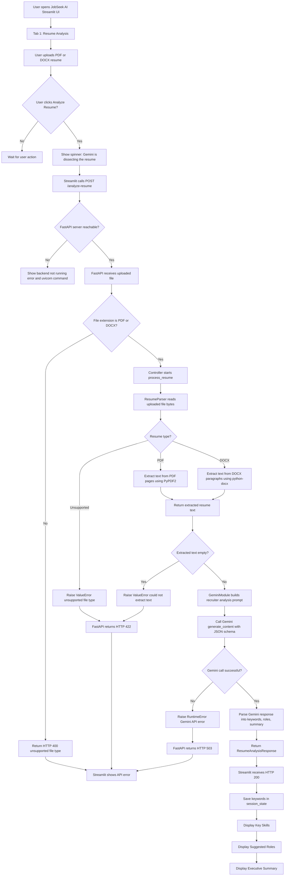

```mermaid
flowchart TD
    A[User opens JobSeek AI Streamlit UI] --> B[Tab 1: Resume Analysis]
    B --> C[User uploads PDF or DOCX resume]
    C --> D{User clicks Analyze Resume?}
    D -- No --> E[Wait for user action]
    D -- Yes --> F[Show spinner: Gemini is dissecting the resume]

    F --> G[Streamlit calls POST /analyze-resume]
    G --> H{FastAPI server reachable?}
    H -- No --> I[Show backend not running error and uvicorn command]
    H -- Yes --> J[FastAPI receives uploaded file]

    J --> K{File extension is PDF or DOCX?}
    K -- No --> L[Return HTTP 400 unsupported file type]
    L --> M[Streamlit shows API error]

    K -- Yes --> N[Controller starts process_resume]
    N --> O[ResumeParser reads uploaded file bytes]
    O --> P{Resume type?}

    P -- PDF --> Q[Extract text from PDF pages using PyPDF2]
    P -- DOCX --> R[Extract text from DOCX paragraphs using python-docx]
    P -- Unsupported --> S[Raise ValueError unsupported file type]

    Q --> T[Return extracted resume text]
    R --> T
    S --> U[FastAPI returns HTTP 422]
    U --> M

    T --> V{Extracted text empty?}
    V -- Yes --> W[Raise ValueError could not extract text]
    W --> U

    V -- No --> X[GeminiModule builds recruiter analysis prompt]
    X --> Y[Call Gemini generate_content with JSON schema]
    Y --> Z{Gemini call successful?}

    Z -- No --> AA[Raise RuntimeError Gemini API error]
    AA --> AB[FastAPI returns HTTP 503]
    AB --> M

    Z -- Yes --> AC[Parse Gemini response into keywords, roles, summary]
    AC --> AD[Return ResumeAnalysisResponse]
    AD --> AE[Streamlit receives HTTP 200]
    AE --> AF[Save keywords in session_state]
    AF --> AG[Display Key Skills]
    AG --> AH[Display Suggested Roles]
    AH --> AI[Display Executive Summary]

```