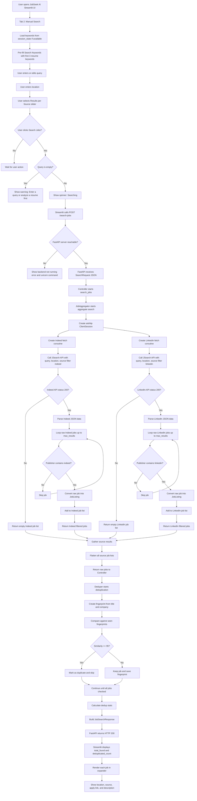

```mermaid
flowchart TD
    A[User opens JobSeek AI Streamlit UI] --> B[Tab 2: Manual Search]
    B --> C[Load keywords from session_state if available]
    C --> D[Pre-fill Search Keywords with first 3 resume keywords]
    D --> E[User enters or edits query]
    E --> F[User enters location]
    F --> G[User selects Results per Source slider]
    G --> H{User clicks Search Jobs?}

    H -- No --> I[Wait for user action]
    H -- Yes --> J{Query is empty?}
    J -- Yes --> K[Show warning: Enter a query or analyze a resume first]
    J -- No --> L[Show spinner: Searching]

    L --> M[Streamlit calls POST /search-jobs]
    M --> N{FastAPI server reachable?}
    N -- No --> O[Show backend not running error and uvicorn command]
    N -- Yes --> P[FastAPI receives SearchRequest JSON]

    P --> Q[Controller starts search_jobs]
    Q --> R[JobAggregator starts aggregate search]
    R --> S[Create aiohttp ClientSession]

    S --> T[Create Indeed fetch coroutine]
    S --> U[Create LinkedIn fetch coroutine]
    T --> V[Call JSearch API with query, location, source filter indeed]
    U --> W[Call JSearch API with query, location, source filter linkedin]

    V --> X{Indeed API status 200?}
    W --> Y{LinkedIn API status 200?}

    X -- No --> Z[Return empty Indeed job list]
    Y -- No --> AA[Return empty LinkedIn job list]

    X -- Yes --> AB[Parse Indeed JSON data]
    Y -- Yes --> AC[Parse LinkedIn JSON data]

    AB --> AD[Loop raw Indeed jobs up to max_results]
    AC --> AE[Loop raw LinkedIn jobs up to max_results]

    AD --> AF{Publisher contains indeed?}
    AE --> AG{Publisher contains linkedin?}

    AF -- No --> AH[Skip job]
    AG -- No --> AI[Skip job]

    AF -- Yes --> AJ[Convert raw job into JobListing]
    AG -- Yes --> AK[Convert raw job into JobListing]

    AH --> AD
    AI --> AE
    AJ --> AL[Add to Indeed job list]
    AK --> AM[Add to LinkedIn job list]

    AL --> AN[Return Indeed filtered jobs]
    AM --> AO[Return LinkedIn filtered jobs]
    Z --> AP[Gather source results]
    AA --> AP
    AN --> AP
    AO --> AP

    AP --> AQ[Flatten all source job lists]
    AQ --> AR[Return raw jobs to Controller]
    AR --> AS[Deduper starts deduplication]

    AS --> AT[Create fingerprint from title and company]
    AT --> AU[Compare against seen fingerprints]
    AU --> AV{Similarity >= 95?}

    AV -- Yes --> AW[Mark as duplicate and skip]
    AV -- No --> AX[Keep job and save fingerprint]

    AW --> AY[Continue until all jobs checked]
    AX --> AY
    AY --> AZ[Calculate dedup stats]

    AZ --> BA[Build JobSearchResponse]
    BA --> BB[FastAPI returns HTTP 200]
    BB --> BC[Streamlit displays total_found and deduplicated_count]
    BC --> BD[Render each job in expander]
    BD --> BE[Show location, source, apply link, and description]

```