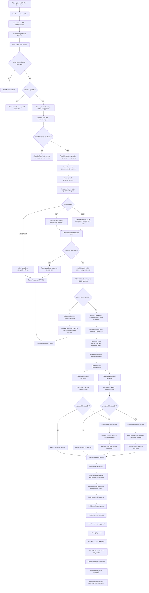

```mermaid
flowchart TD
    A[User opens JobSeek AI Streamlit UI] --> B[Tab 3: Auto-Match Jobs]
    B --> C[User uploads PDF or DOCX resume]
    C --> D[User enters preferred location]
    D --> E[User enters max results]
    E --> F{User clicks Find My Matches?}

    F -- No --> G[Wait for user action]
    F -- Yes --> H{Resume uploaded?}
    H -- No --> I[Show error: Please upload a resume]
    H -- Yes --> J[Show spinner: Running end-to-end pipeline]

    J --> K[Streamlit calls POST /resume-to-jobs]
    K --> L{FastAPI server reachable?}
    L -- No --> M[Show backend not running error and uvicorn command]
    L -- Yes --> N[FastAPI receives uploaded file, location, max_results]

    N --> O[Controller starts resume_to_jobs pipeline]
    O --> P[Controller calls process_resume]
    P --> Q[ResumeParser reads uploaded file bytes]
    Q --> R{Resume type?}

    R -- PDF --> S[Extract text from PDF pages using PyPDF2]
    R -- DOCX --> T[Extract text from DOCX paragraphs using python-docx]
    R -- Unsupported --> U[Raise ValueError unsupported file type]

    S --> V[Return extracted resume text]
    T --> V
    U --> W[FastAPI returns HTTP 422]
    W --> X[Streamlit shows API error]

    V --> Y{Extracted text empty?}
    Y -- Yes --> Z[Raise ValueError could not extract text]
    Z --> W

    Y -- No --> AA[GeminiModule builds resume analysis prompt]
    AA --> AB[Call Gemini with structured JSON schema]
    AB --> AC{Gemini call successful?}

    AC -- No --> AD[Raise RuntimeError Gemini API error]
    AD --> AE[FastAPI returns HTTP 500 from resume-to-jobs handler]
    AE --> X

    AC -- Yes --> AF[Receive keywords, suggested roles, skills summary]
    AF --> AG[Generate search query from first 3 keywords]
    AG --> AH[Controller calls search_jobs with generated query]

    AH --> AI[JobAggregator starts aggregate search]
    AI --> AJ[Create aiohttp ClientSession]
    AJ --> AK[Create Indeed fetch coroutine]
    AJ --> AL[Create LinkedIn fetch coroutine]

    AK --> AM[Call JSearch API for Indeed results]
    AL --> AN[Call JSearch API for LinkedIn results]

    AM --> AO{Indeed API status 200?}
    AN --> AP{LinkedIn API status 200?}

    AO -- No --> AQ[Return empty Indeed list]
    AP -- No --> AR[Return empty LinkedIn list]

    AO -- Yes --> AS[Parse Indeed JSON data]
    AP -- Yes --> AT[Parse LinkedIn JSON data]

    AS --> AU[Filter raw jobs by publisher containing indeed]
    AT --> AV[Filter raw jobs by publisher containing linkedin]

    AU --> AW[Convert matching jobs to JobListing]
    AV --> AX[Convert matching jobs to JobListing]

    AQ --> AY[Gather all source results]
    AR --> AY
    AW --> AY
    AX --> AY

    AY --> AZ[Flatten source job lists]
    AZ --> BA[Deduplicate jobs by title and company fingerprint]
    BA --> BB[Calculate total_found and deduplicated_count]
    BB --> BC[Build JobSearchResponse]

    BC --> BD[Build combined response]
    BD --> BE[Include resume_analysis]
    BE --> BF[Include search_query_used]
    BF --> BG[Include job_results]

    BG --> BH[FastAPI returns HTTP 200]
    BH --> BI[Streamlit reads payload job_results]
    BI --> BJ[Display job count summary]
    BJ --> BK[Render each job in expander]
    BK --> BL[Show location, source, apply link, and description]

```